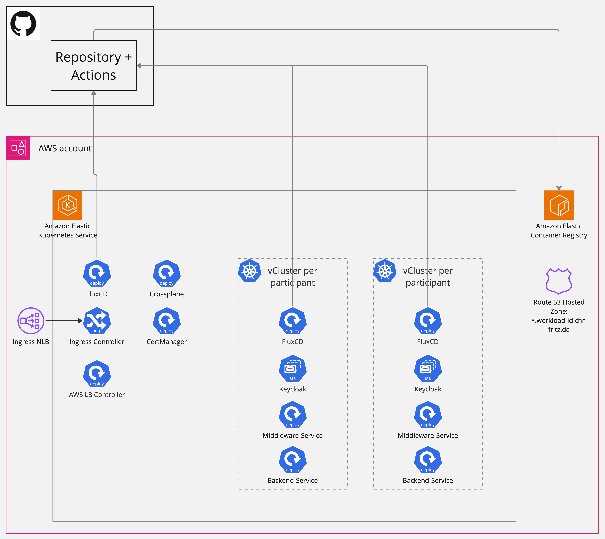
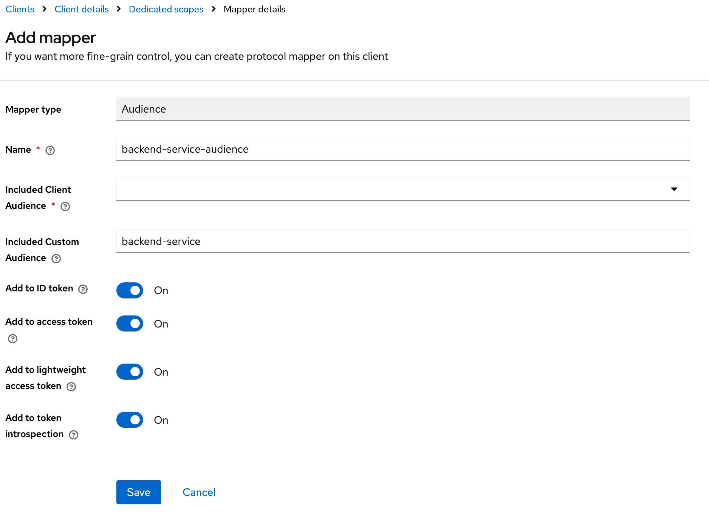

# Hands on: Workload Identity - Wie wird man statische Zugangsdaten los?

<!-- TOC -->

* [Hands on: Workload Identity - Wie wird man statische Zugangsdaten los?](#hands-on-workload-identity---wie-wird-man-statische-zugangsdaten-los)
    * [Einführung](#einführung)
        * [Infrastruktur](#infrastruktur)
    * [Schritt 1: Teilnehmer Cluster erstellen](#schritt-1-teilnehmer-cluster-erstellen)
    * [Schritt 2: Keycloak im Cluster installieren](#schritt-2-keycloak-im-cluster-installieren)
    * [Schritt 3: Backend Service im Cluster installieren](#schritt-3-backend-service-im-cluster-installieren)
    * [Schritt 4: Middleware Server im Cluster installieren](#schritt-4-middleware-server-im-cluster-installieren)
    * [Schritt 5: Middleware Server als Client in Keycloak anlegen](#schritt-5-middleware-server-als-client-in-keycloak-anlegen)
        * [Client anlegen](#client-anlegen)
        * [Audience für Backend-Service hinzufügen](#audience-für-backend-service-hinzufügen)
    * [Abschluss](#abschluss)

<!-- TOC -->

## Einführung

Der Workshop zeigt einige Anwendungsbeispiele in denen die Authentifizierung von Diensten, Anwendungen und Containern
gegenüber AWS und anderen Anwendungen durch die Verwendung von Workload IDs sichergestellt ist. Anstatt regulärer
Passwörter, Client Secrets oder API Secret Keys kommen asynchrone Public Key Verfahren und explizite
Vertrauensbeziehungen zum Einsatz.

### Infrastruktur

Der Workshop nutzt einen von den Trainern zur Verfügung gestellten AWS EKS Cluster. Nahezu die gesamte Infrastruktur,
welche innerhalb dieses Clusters läuft, ist ebenfalls as-Code im Repository abgelegt:

* Setup EKS Cluster mit `eksctl`: [eks/main-cluster.yaml](../infrastructure/aws/eks/main-cluster.yaml)
* Kubernetes Resourcen im Cluster: [workshop-main-cluster](../cluster/workshop-main-cluster)
    * FluxCD als GitOps: [flux-system](../cluster/workshop-main-cluster/flux-system)
    * Crossplane um AWS Resourcen anzulegen: [crossplane-system](../cluster/workshop-main-cluster/crossplane-system)
    * Zusätzliche AWS Resourcen mit Crossplane: [aws-setup](../cluster/workshop-main-cluster/aws-setup)

Lediglich für Crossplane ist eine (weitreichende) AWS Role notwendig welche Crossplane den Zugriff auf AWS ermöglicht.
Diese hat derzeit folgende `PolicyAttachments`:

* `AmazonEC2ContainerRegistryFullAccess`
* `AmazonRoute53FullAccess`
* `IAMFullAccess`
* `SecretsManagerReadWrite`

Weiterhin wurde ihr die folgende Trust Policy zugewiesen:

```json
{
    "Version": "2012-10-17",
    "Statement": [
        {
            "Effect": "Allow",
            "Principal": {
                "Federated": "arn:aws:iam::730335410257:oidc-provider/oidc.eks.eu-central-1.amazonaws.com/id/16863A4F160277A9C0E1AC5E63C373EB"
            },
            "Action": "sts:AssumeRoleWithWebIdentity",
            "Condition": {
                "StringEquals": {
                    "oidc.eks.eu-central-1.amazonaws.com/id/16863A4F160277A9C0E1AC5E63C373EB:aud": "sts.amazonaws.com"
                },
                "StringLike": {
                    "oidc.eks.eu-central-1.amazonaws.com/id/16863A4F160277A9C0E1AC5E63C373EB:sub": "system:serviceaccount:crossplane-system:provider-aws-*"
                }
            }
        }
    ]
}
```

In diesem Cluster erstellen die Teilnehmer mit [vCluster](https://www.vcluster.com/) ihre eigenen Workshop Kubernetes
Cluster.

Das folgende Bild zeigt die gesamte Infrastruktur mit allen Komponenten am Ende des Workshops:



## Schritt 1: Teilnehmer Cluster erstellen

Um einen Teilnehmer Cluster zu erstellen, muss zunächst das
Repository [geforked](https://github.com/chr-fritz/workload-identity/fork) werden. Wichtig ist alle Branches mit zu
forken: .

Anschließend muss das Repository geklont, das Upstream-Repository konfiguriert und der Branch gewechselt werden:

```shell
git clone https://github.com/<YOUR-USERNAME>/workload-identity
git remote add upstream https://github.com/chr-fritz/workload-identity
git checkout cloudland-2024
```

Alternativ sollte SSH zum Klonen verwendet werden:

```shell
git clone git@github.com:<YOUR-USERNAME>/workload-identity
git remote add upstream git@github.com:chr-fritz/workload-identity.git
git checkout cloudland-2024
```

Nun kann der vCluster angelegt werden. Hierfür muss das
Verzeichnis [cluster/workshop-main-cluster/participants/template](../cluster/workshop-main-cluster/participants/template)
kopiert werden. Der neue Name des Verzeichnisses muss dem GitHub Benutzernamen des Teilnehmers entsprechen.

Innerhalb des kopierten Verzeichnisses müssen die Referenzen `template` durch den eigenen GitHub Benutzernamen ersetzt
werden. Weiter muss in der
Datei [cluster/workshop-participant-cluster/flux-system/gotk-sync.yaml](../cluster/workshop-participant-cluster/flux-system/gotk-sync.yaml#L14)
innerhalb der Git URL der String `template` durch den eigenen GitHub Benutzernamen ersetzt werden.

Alle so vorgenommen Änderungen müssen nun committed, gepushed und per PullRequest an das Hauptrepository erstellt
werden:

```shell
# Add changed files to index (working dir is repository root)
git add cluster/workshop-main-cluster/participants/template cluster/workshop-participant-cluster/flux-system/gotk-sync.yaml
git commit -m"Onboard Worshop participant <YOUR-USERNAME>"
git push
```

Nun kann der PullRequest erstellt [^1] werden. Wichtig ist, dass als Base-Branch `cloudland-2024` ausgewählt ist.

Nach dem Merge findet sich
im [Workflow add-participant.yaml](https://github.com/chr-fritz/workload-identity/actions/workflows/add-participant.yaml)
ein Run für den jeweiligen PR, in welchem der Public Key ausgegeben wird mit dem sich die Flux Instanz aus dem eigenen
Cluster mit GitHub verbindet. Dieser muss als Deployment Key im Repository hinterlegt werden.

## Schritt 2: Keycloak im Cluster installieren

* Branch Ausgangssituation: `cloudland-2024-step-2-setup-keycloak`
* Branch Lösung (ohne Teilnehmer spezifische Anpassungen): `cloudland-2024-step-2-setup-keycloak-final`

Nun muss mit Flux das Helm-Chart von [Keycloak](https://github.com/bitnami/charts/tree/main/bitnami/keycloak)
installiert werden. Dabei müssen unter anderem folgende Anpassungen an den Helm-Values durchgeführt werden:

1. Image: Im originalen Image ist
   der [Keycloak Kubernetes Client Authenticator](https://github.com/chr-fritz/keycloak-kubernetes-authenticator) nicht
   enthalten. Muss das erweiterte Image verwendet werden. Dieses wird über den
   Workflow [build-keycloak-extended-image.yaml](../.github/workflows/build-keycloak-extended-image.yaml). Dort findet
   sich auch der volle Image-Name, welcher für das Setup verwendet werden soll.
2. Zusätzlich ist es sinnvoll die Admin-User Daten passend zu setzen.
3. Für den externen Zugriff sollte ein Ingress hinzugefügt werden:
   ```yaml
   ingress:
      enabled: true
      hostname: keycloak-<YOUR-GITHUB-USERNAME>.workload-id.chr-fritz.de
      tls: true
      selfSigned: false
      ingressClassName: nginx
      secrets:
        # Secrets are not required, the Ingress is synchronized to the main cluster which already have a wildcard certificate.
        - name: none
   ``` 

Als Extra können Teilnehmer ihre eigene ECR erstellen und ein selbst gebautes Image verwenden. Der gesamte Code findet
sich im Repository. Zum Erstellen der ECR bitte einen neuen Branch vom originalen `cloudland-2024` Branch erstellen und
die jeweiligen Änderungen als PullRequest an das Haupt-Repository übertragen.

## Schritt 3: Backend Service im Cluster installieren

* Branch Ausgangssituation: `cloudland-2024-step-3-setup-backend-service`
* Branch Lösung (ohne Teilnehmer spezifische Anpassungen): `cloudland-2024-step-3-setup-backend-service-final`

In diesem Schritt wird
der [Backend-Service](https://github.com/chr-fritz/security-lab-oidc-integrations/tree/main/backend-service)
installiert. Dies ist ein einfacher Service welcher das mitgeschickte Token validiert und den präferierten Benutzernamen
des Aufrufers zurückliefert.

Ein Beispiel des Setups ist im [Demo-Cluster](../cluster/talk-demo) zu finden. Notwendig ist neben dem eigentlichen
Kubernetes Deployment, ein Service für den Cluster-internen Zugriff und ein ServiceAccount um zu umfangreiche Rechte zu
verhindern.

## Schritt 4: Middleware Server im Cluster installieren

* Branch Ausgangssituation: `cloudland-2024-step-4-setup-middlware-service`
* Branch Lösung (ohne Teilnehmer spezifische Anpassungen): `cloudland-2024-step-4-setup-middlware-service-final`

Der letzte Service im Teilnehmer Cluster ist der [Middleware Service](../services/middleware-server). Dieser erlaubt es
Aufrufern sich am Identity Provider (dem in Schritt 2 installierten Keycloak) anzumelden, ruft den bevorzugten
Benutzernamen des Aufrufers vom Backend-Service aus Schritt drei ab und zeigt diesen an.

Ein Beispiel Setup ist, wie auch beim Backend-Service, ebenfalls im Demo-Cluster zu finden. Zusätzlich zu dem auch im
Backend-Service angelegten Kubernetes Deployment, dem Service und dem Service Account wird nun auch noch ein Ingress für
den externen Zugriff und eine ConfigMap für die Konfiguration benötigt.

Auch das Kubernetes Deployment muss um einen zusätzlichen `VolumeMount` vom Typ `projected` [^2] erweitert werden, um
das ServiceAccount Token bereitzustellen. Dieses muss als `audience` die Issuer-URL von Keycloak enthalten, da es
anstatt ClientID und ClientSecret für die Client-Authentifizierung am Keycloak-Token-Endpoint verwendet wird.

## Schritt 5: Middleware Server als Client in Keycloak anlegen

Nun sollte der Middleware-Server aufgerufen werden können und direkt auf die Login-Seite von Keycloak weiterleiten. Da
allerdings noch kein Client in Keycloak hinterlegt ist, muss dieser erst angelegt werden. Dies kann über die Keycloak
Administrationsoberfläche [^3] geschehen.

### Client anlegen

Beim Anlegen des Clients für den Middleware-Services kann in den meisten Teilen der Keycloak Dokumentation gefolgt
werden. Da die Client-Authentifizierung nicht wie üblich per ClientID und ClientSecret durchgeführt werden soll, müssen
einige Vorgaben welche
der [Keycloak Kubernetes Client Authenticator](https://github.com/chr-fritz/keycloak-kubernetes-authenticator) macht
beachtet werden.

1. In der Client-Beschreibung den Service-Account Namen gefolgt
   von `@https://oidc.eks.eu-central-1.amazonaws.com/id/16863A4F160277A9C0E1AC5E63C373EB` eintragen:
   ```
   system:serviceaccount:<k8s-namespace>:<serviceAccountName>@https://oidc.eks.eu-central-1.amazonaws.com/id/16863A4F160277A9C0E1AC5E63C373EB 
   ```
   **TODO:** Tatsächlichen Service Account Namen herausfinden (vCluster vs. EKS)
2. Unter "Credentials" den Client Authenticator "Kubernetes Service Account auswählen"
3. Unter "Keys" "Use JWKS URL" einschalten und folgende "JWKS URL" hinterlegen:
   ```
   https://oidc.eks.eu-central-1.amazonaws.com/id/16863A4F160277A9C0E1AC5E63C373EB/keys
   ```

Darüber hinaus muss die Redirect-URL korrekt gesetzt sein. Empfehlung ist hier entweder die vollständige zu verwenden
oder eine Wildcard auf den Hostnamen des Ingresses inkl. `https://`.

Nun sollte beim Aufruf des Middleware-Services der Login über Keycloak klappen.

### Audience für Backend-Service hinzufügen

Trotzdem kommt noch eine Fehlermeldung vom Backend-Service zurück. Grund hierfür ist, dass der Backend-Service die
Audience `backend-service` im übertragenen Access-Token erwartet. Hierfür muss im Keycloak Client des
Middleware-Services der Client-Scope `<CLIENT-NAME>-dedicated` um einen weiteren Mapper vom Typ "Audience" erweitert
werden. Hierzu über `Add mapper` --> `By Configuration` einen weiteren Mapper anlegen und folgendermaßen konfigurieren:


Nun sollte der Aufruf (nach Löschen der Cookies und erneutem Login) funktionieren und der
Middleware-Service `Hallo <Nutzer>` ausgeben.

## Abschluss

Im Workshop wurden mehrere Services in einem Cluster deployed welche sicher untereinander kommunizieren wobei keinerlei
Passwörter zum Einsatz kommen. Selbst die gesamte Infrastruktur des Workshops kommt weitestgehend ohne statische
Zugangsdaten aus. Diese ist ebenfalls hier im Repository eingecheckt und kann eingesehen werden. Lediglich beim Zugang
zu GitHub und AWS sind noch Benutzerspezifische Passwörter vorhanden.

Ja, Keycloak nutzt tatsächlich noch ein Passwort für den Zugriff auf die Postgresql DB. AWS bietet mit
dem [aws-advanced-jdbc-wrapper](https://github.com/aws/aws-advanced-jdbc-wrapper) IAM Rollenbasierten Login in RDS
Datenbanken an. Allerdings ist das Setup leider nicht vollständig as-Code fähig so, dass es im Workshop nicht umgesetzt
wurde.

[^1]: GitHub Dokumentation:
[Erstellen eines PR](https://docs.github.com/de/pull-requests/collaborating-with-pull-requests/proposing-changes-to-your-work-with-pull-requests/creating-a-pull-request)
[^2]: [Launch a Pod using service account token projection](https://kubernetes.io/docs/tasks/configure-pod-container/configure-service-account/#launch-a-pod-using-service-account-token-projection)
[^3]: [Managing OpenID Connect and SAML Clients](https://www.keycloak.org/docs/latest/server_admin/#assembly-managing-clients_server_administration_guide)